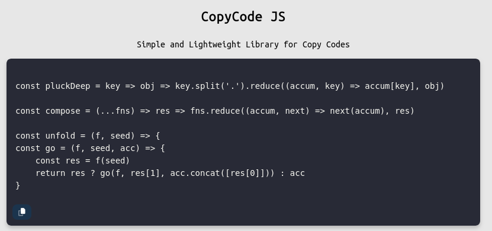

# CopyCode JS

Simple and Lightweight Library for Copy-paste Codes

# How to use

Add this two file in tag body.

Add JQuery:

```html
<script src="https://code.jquery.com/jquery-3.7.1.min.js"></script>
```
Add copycode.js:

```html
<script src="js/galleryslide.js"></script>
```

CSS:

```css
.precode .copy {
    position: absolute;
    margin: -50px 0px 0px 10px;
}

.copy {
    border: 0;
    padding: 5px 10px;
    border-radius: 8px;
    background-color: #1b344d;
    color: #fff;
}

.fa-check {
    color: green;
}
```

# Settings

In using copycode.js you deal with two tags `pre` and `code`. for set the button, use style for button settings and it is compatible in any editor that supports these two tags.

# Screenshot and Demo

Demo: https://rayiumir.github.io/copycode-js/

<picture>
  <source media="(prefers-color-scheme: dark)" srcset="./screenshots/screenshot.png">
  <source media="(prefers-color-scheme: light)" srcset="./screenshots/screenshot.png">
  
</picture>